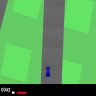
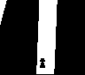
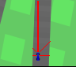

# CarRacing-v2
Practice project based on [gymnasium](https://gymnasium.farama.org/) [CarRacing-v2](https://gymnasium.farama.org/environments/box2d/car_racing) environment.

# Test model
You can test model by running `test.py` and providing path to save model.

# Train model
You can run `test.py` with path to model. `best.npz` is the best obtained model for now.  

# Environment

Game 'CarRacing-v2' was chosen for task. Game is tuned to be discrete and have same color of environment

## Input space

Image of current frame of game: RGB array (96 x 96 x 3).
Color of the road, grass and car constant.

`Note`: given gif is human version of input. Real input is more pixelated.

## Action space
One single integer value:
- 0 - do nothing
- 1 - steer left
- 2 - steer right
- 3 - gas
- 4 - break

## Input processing
Actual input image

### **UI**
In the bottom of the image we have (from left to right):
- reward (default from *gymnasium*)
- speed
- ABS sensors
- wheel angle
- gyroscope

In current approach only speed and wheel angle was exctracted using opencv.

### **Rays**
Instead of using whole image to pass as input we will use distance from car to not track pixel in some direction.

To do this, we binarize image using rgb-color of road (*105, 105, 105*). Everything that is close to this color of road is road. This method works pretty well for such simple image. Example:

Then we send rays in direction to compute distance to end of road. Rays directions are forward, left side, right side, left 45 degree, right 45 degree 
Example:

## Input format
7 float values:
- speed
- wheel rotation
- forward distance
- left side distance
- right side distance
- left 45 degree distance
- right 45 degree distance

# Model

For movement control simple ANN was used:
- input (7)
- hidden1 (8 neurons, ReLU)
- hidden2 (6 neurons, ReLU)
- hidden3 (6 neurons, Linear)
- output (5)

To obtain correct weights `Genetic Algorithm` is used.

# Genetic Algorithm

## Fintess function
Total reward is calculated based on whole race consisting of 300 actions. Every frame reward is increased by `speed - 1`. If car get off track reward is decreased by `10` every frame.

## Mutation
One layer is choosed to be mutated randomly. Then every layer can mutate with `0.3` probability.

Inside layer we randomly select `3` neurons that we will assign random new weight and bias

## Crossover
Offspring is a copy of one parent with 1 layer from second parent. Then offspring mutate.