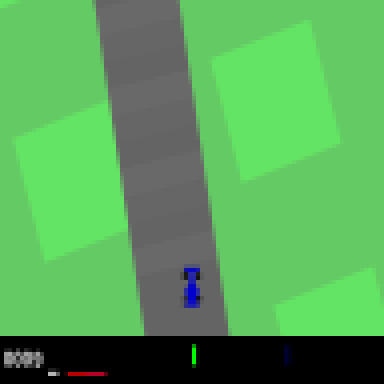

# Nature Inspired Computing for Gaming: Evolutionary Neural Network for game AI Algorithm

Evolutionary Neural Networks are promising method that can make development of game AI much easier. In this repo, we provide code for 2 methods: Fully Connected ANN and NEAT.

# Contents
- [Problem description](#problem-description)
    -[Observation space](#observation-space)
    -[Action space](#action-space)
- [Installation guide](#installation-guide)
- [How to run](#how-to-run)
    - [ANN](#ann)
    - [NEAT](#neat)
- [Methodology](#methodology)
- [Experiments](#experiments)

# Problem description
To test our methods [Car Racing](https://gymnasium.farama.org/environments/box2d/car_racing/) Gymnasium environment was used. In the environment an agent should control racing car and finish track as fast as possible.

## Observation space

96 by 96 RGB image of game:



## Action space
Action space consists of 3 numbers: steering (number from -1, full turn to the left, to 1, full turn to the right), gas (from 0, not accelerate, to 1, full acceleration), and breaking (from 0, no breaking, to 1, full breaking).

# Installation guide
Python version `3.10.6` was used during development. However, others version may work. Keep in mind that `.pkl` files are version dependent.

You can find all needed python packages in [requirements.txt](./requirements.txt). To simply install it you can run:
```bash
    pip3 install -r requirements.txt
```

# How to run

## ANN
Configs resides at `configs/ann_config.yaml`.

Training ANN can be done as:
```bash
    python3 train_ann.py 'output_model_path'.npz
```

You can test model by:
```bash
    python3 test_ann.py 'model_path'npz
```
To test our best model run:
```bash
    python3 test_ann.py best_models/best.npz
```

## NEAT
Confgis of binary and ray preprocessings are at `configs/neat_config_binary` ad `configs/neat_config_ray` respectively.

To train NEAT model:
```bash
    python3 train_neat.py 'output_model_path'.pkl ray|binary
```
Example of training ray method:
```bash
    python3 train_neat.py current.pkl ray
```

To test model simply run:
```bash
    python3 test_neat.py `model_path`.pkl ray|binary
```
To run best ray preprocessing model:
```bash
    python3 test_neat.py best_models/ray_best.plk ray
```
To run best binary preprocessing model:
```bash
    python3 test_neat.py best_models/binary_best.plk binary
```
# Methodology

To see detailed explanation and analysis see [paper](./paper.pdf).

# Experiments

You can find video of experiments [here](https://www.youtube.com/watch?v=6dMTmt6c7cw&list=PLgk8UCl0Q4KQJYdj-jkraO6LwLWyUwjBO)